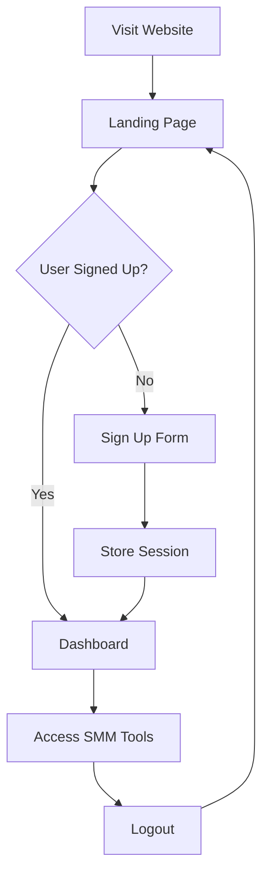

# 🚀 Smart SMM Assistant

A complete AI-powered Social Media Marketing platform with a professional landing page and secure authentication system. Users sign up through a modern landing page before accessing personalized growth strategies for their social media platforms.

## 🌟 Features

### Landing Page (`index.html`)
- **Professional Hero Section**: Animated gradient background with floating platform icons
- **How It Works**: Clear 3-step process explanation
- **Platform Showcase**: 12+ supported social media platforms
- **User Testimonials**: Social proof from satisfied customers
- **Secure Sign-Up**: Email validation and platform preference selection
- **Responsive Design**: Perfect on all devices with smooth animations

### Main Application (`app.html`)
- **Authentication Protected**: Only accessible after sign-up
- **AI-Powered Plans**: Personalized growth strategies based on user goals and budget
- **Interactive Platform Selection**: Visual selection with hover effects
- **Step-by-Step Flow**: Guided process from platform selection to campaign launch
- **User Session Management**: Persistent login with logout functionality

## 🎯 User Journey

1. **Landing Page**: Visitors see professional marketing page at `/`
2. **Sign-Up Process**: Users enter email, name, and preferred platform
3. **Authentication**: Session stored securely in browser
4. **Dashboard Access**: Redirected to protected SMM planning tool
5. **AI Planning**: Create personalized social media growth strategies
6. **Campaign Launch**: Execute plans with celebration effects

## 🚀 Getting Started

### Option 1: Local Development
```bash
# Clone the repository
git clone https://github.com/larbito/smmAI.git
cd smmAI

# Open in browser
open index.html
```

### Option 2: GitHub Pages (Live Demo)
Visit: **https://larbito.github.io/smmAI**

## 📁 File Structure
```
├── index.html           # Landing page (entry point)
├── index-styles.css     # Landing page styling
├── index-script.js      # Landing page functionality
├── app.html            # Protected main application
├── app-styles.css      # Main app styling  
├── app-script.js       # Main app functionality
└── README.md           # Documentation
```

## 💻 Technology Stack

- **Frontend**: HTML5, CSS3, Vanilla JavaScript
- **Styling**: Modern CSS with gradients, animations, and responsive design
- **Authentication**: LocalStorage-based session management
- **Icons**: Font Awesome for professional social media icons
- **No Dependencies**: Pure JavaScript for maximum performance

## 📱 Supported Platforms

- **Social Media**: Instagram, TikTok, YouTube, Facebook, Twitter/X, LinkedIn
- **Audio**: Spotify, Discord, Telegram
- **Gaming**: Twitch, Steam
- **Business**: Google Reviews, Website Traffic
- **And More**: Snapchat, Pinterest, Reddit

## 🎨 Design Features

### Landing Page
- **Hero Animation**: Gradient background with floating platform icons
- **Particle Effects**: Subtle sparkle animations
- **Smooth Scrolling**: Navigation with offset for fixed header
- **Form Validation**: Real-time email and input validation
- **Success Modal**: Celebration effects on sign-up

### Main Application
- **Authentication Guard**: Automatic redirect if not logged in
- **User Welcome**: Personalized header with user name
- **Platform Pre-selection**: Based on landing page preference
- **Loading States**: Beautiful animations during AI processing
- **Confetti Effects**: Celebration on campaign success

## 🔐 Authentication Flow



## 🚀 Deployment

### GitHub Pages Setup
1. Go to repository Settings
2. Navigate to Pages section
3. Select "Deploy from branch: main"
4. Your site will be live at: `https://username.github.io/smmAI`

### Custom Domain (Optional)
Add a `CNAME` file with your domain name for custom branding.

## 🎯 Future Enhancements

- **Backend Integration**: Real SMM API connections
- **Payment System**: Stripe integration for premium features
- **Advanced Analytics**: Campaign tracking and reporting
- **Team Collaboration**: Multi-user account management
- **API Development**: Developer access to SMM tools
- **Mobile App**: React Native or Flutter version

## 📊 Performance Features

- **Fast Loading**: Optimized CSS and JavaScript
- **Progressive Enhancement**: Works without JavaScript for basic navigation
- **Accessibility**: WCAG compliant with proper contrast and navigation
- **SEO Optimized**: Meta tags and semantic HTML structure

## 🎉 Demo Features

Try these features in the live demo:
1. **Landing Experience**: Smooth animations and professional design
2. **Sign-Up Flow**: Complete form validation and success celebration
3. **Protected Access**: Try accessing `/app.html` directly (will redirect)
4. **AI Planning**: Generate realistic SMM strategies
5. **Session Persistence**: Close browser and return (stays logged in)

## 📄 License

This project is open source and available under the MIT License.

---

**🚀 Ready to revolutionize social media marketing with AI?**  
**[Get Started Now](https://larbito.github.io/smmAI)** ✨

*Built with ❤️ for content creators, marketers, and social media enthusiasts* 